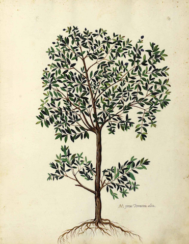

# CART

**C**lassification **A**nd **R**egression **T**rees
 
## Overview 

This library supports the construction and interpretation of decision trees
and their ensembles, along with utilities for visualizing trees and generating summaries of data. 

## Usage

TODO: Write some examples

## FAQ

### What are decision trees?

They are a class of nonparametric model suitable for both classification and regression.

### Why should I use decision trees instead of some other method?

They are interpretable by design and can be very accurate. [Scikit](http://scikit-learn.org/stable/modules/tree.html) gives
a list of good reasons to use them.

## References

Directly based on the ideas and work laid out in:

  * Breiman, Leo, et al. Classification and regression trees. CRC press, 1984.
  * Quinlan, J. Ross. C4. 5: programs for machine learning. Elsevier, 2014.
  * Breiman, Leo. "Random forests." Machine learning 45.1 (2001): 5-32.
  * Freund, Yoav, and Robert E. Schapire. "A desicion-theoretic generalization of on-line learning and an application to boosting." European conference on computational learning theory. Springer, Berlin, Heidelberg, 1995.
  * Friedman, Jerome H. "Greedy function approximation: a gradient boosting machine." Annals of statistics (2001): 1189-1232.

The drawing of the olive tree is by [Ulisse Aldrovandi](https://en.wikipedia.org/wiki/Ulisse_Aldrovandi).

## Copyright and Licensing 

Copyright © 2017 Arthur Maciejewicz

Distributed under the Apache License, Version 2
